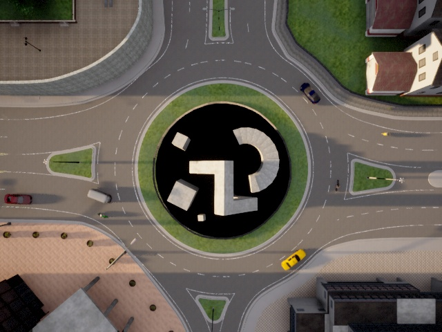
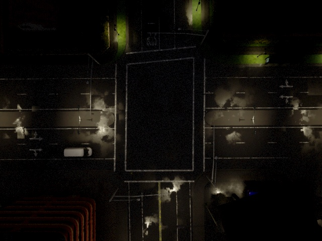
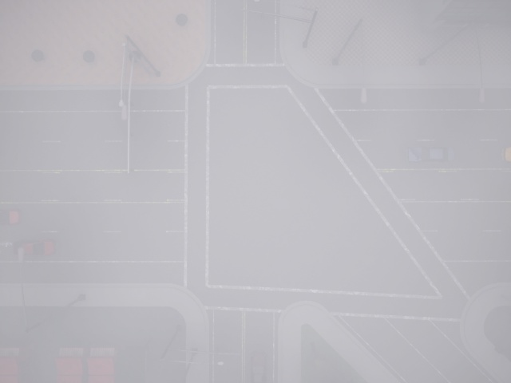

# 🚁 Drone Simulation for Dataset Acquisition

🎓 *University Project – Robotics 2 Course, Politecnico di Bari*

A **drone-based image and video acquisition system** developed in the **CARLA simulator**, integrated with **ROS** and **Docker** for managing urban simulation environments.  
This project explores autonomous UAV operations in complex city scenarios for repeatable dataset generation.

---

## 🌆 Overview

The project focuses on using the **CARLA simulator** to capture **images and videos** through a **drone equipped with a downward-facing camera** flying over urban intersections.  
By setting a fixed seed, the simulator ensures that the same scene, including vehicles and pedestrians, is **repeatable**, allowing consistent dataset generation.

  

---

## 🧰 Technologies

- 
- 
- 
- 
- 
- 

---

## ⚙️ System Description

The **simulation environment** is built using CARLA’s **Unreal Engine-based** infrastructure, which enables realistic modeling of city intersections populated by cars and pedestrians.  
The workflow consists of several stages:

1. **Environment Configuration** – Setting up urban intersections and environmental conditions.  
2. **Scenario Population** – Using Python scripts to spawn vehicles and pedestrians.  
3. **Drone Control** – Managing the drone’s flight path and altitude via ROS topics.  
4. **Data Recording** – Capturing synchronized **images and videos** through ROS and Python APIs.  

  

All simulation tasks were executed on a **remote server** through **SSH** and **Windows Remote Desktop**, ensuring efficient management of computation-heavy processes.

---

## 🧪 Results

The system allows the drone to fly autonomously across **different intersections** and **weather conditions**, enabling dataset acquisition under a wide variety of realistic scenarios.

  

Captured data was used for further **computer vision and robotics applications**, such as obstacle detection, object tracking, and autonomous navigation research.

---

## 📁 Repository Structure

- images/ → Contains screenshots from various simulated weather conditions
- LinkSimulations.txt → Dropbox link to videos and images of the experiments
- docker_ws/Dockerfile.txt → Automates environment configuration
- Weather properties.xlsx → Detailed configuration of each simulated weather condition
- rviz_carla_RGBdown.rviz → Custom RViz configuration file
- flying_sensor_full.json → JSON file defining CARLA sensors and objects

- carla_spawn_objects/ → ROS package for spawning and managing objects in CARLA
  - src/carla_spawn_objects/
    - carla_spawn_objects.py → Spawns vehicles and pedestrians
    - traffic_manager.py → Traffic Manager integration
    - drone_image.py → Captures simulation images and videos
  - launch/
    - carla_spawn_objects.launch → Launches object spawning
    - traffic_manager.launch → Launches Traffic Manager
    - drone_image.launch → Launches image capture

- carla_ros_bridge/ → Handles CARLA–ROS communication
  - launch/carla_ros_bridge.launch
  - src/carla_ros_bridge/bridge.py

---

## 👥 Authors

Developed by [Francesco Savino](https://github.com/FrankSav80) and [Tommaso Savino](https://github.com/ItsTomSav)  
Master’s Degree in Automation and Robotics Engineering – Politecnico di Bari

---

## 🧠 Keywords

`CARLA` • `ROS` • `Drone Simulation` • `Dataset Acquisition` • `Python` • `Docker` • `Robotics 2`

